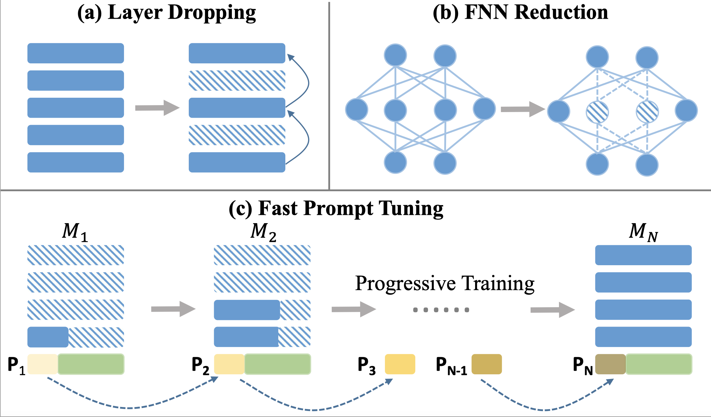
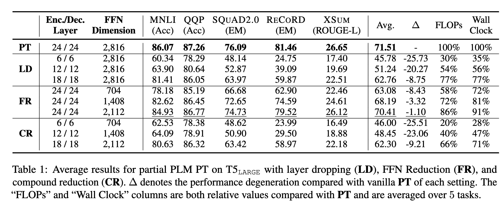

# FPT: Improving Prompt Tuning Efficiency via Progressive Training

This is the official PyTorch implementation for Findings of EMNLP 2022 paper "FPT: Improving Prompt Tuning Efficiency via Progressive Training"

If you use the code, please cite the following paper:
```
@inproceedings{huang2022fpt,
  title={{FPT}: Improving Prompt Tuning Efficiency via Progressive Training},
  author={Huang, Yufei and Qin, Yujia and Wang, Huadong and Yin, Yichun and Sun, Maosong and Liu, Zhiyuan and Liu, Qun},
  booktitle={Findings of EMNLP 2022},
  year={2022}
}
```

## Quick Links

+ [Overview](#overview)
+ [Requirments](#requirments)
+ [Data Preparation](#data-preparation)
+ [Experiments](#experiments)
    + [Get activation scores](#get-activation-scores)
    + [Prompt Tuning on a Partial PLM](#prompt-tuning-on-a-partial-plm)
    + [Fast Prompt Tuning](#fast-prompt-tuning)

## Overview


In this work, we proppose Fast
Prompt Tuning (FPT), which starts by conducting PT using a small-scale partial PLM, then progressively expands its depth and width until the full-model size. By using FPT, we can save over 30% training computations while achieving comparable performance with vanilla Prompt Tuning. You can find more details in our paper.

## Requirments
+ Python: 3.8.12

```
torch==1.11.0
transformers==4.13.0
numpy==1.21.4
ptflops==0.6.7
sklearn
tensorboard
```
To set up the dependencies, you can run the following command:
```
pip install -r requirements.txt
```
Note that you should install the correct version of PyTorch that matches your CUDA version. See [PyTorch official website](https://pytorch.org/) for instructions.

The code of T5 is based on [Huggingface](https://github.com/huggingface/transformers) with some minor modifications.

## Data Preparation
We have provided a scripts to download all the datasets we used in our paper. You can run the following command to download the datasets:
```
bash data/download.sh all
```
The above command will download all the datasets including

+ MNLI
+ QQP
+ ReCoRD
+ SQuAD2.0
+ XSum

If you only want to download a specific dataset, you can run the following command:

```
bash data/download.sh $dataset_name1 $dataset_name2 ...
```
where $dataset_nameX can be one or multiple of mnli, qqp, record, squad2, xsum.

## Experiments
If you download pretrained language models from [Huggingface Models](https://huggingface.co/google/t5-large-lm-adapt), you need to specify the path of downloaded models in scripts files.

### Get activation scores
Before experiments, we need to compute activation scores of each neurons in pretrianed language models. It will generate activation scores of all tasks on both LARGE and XL models. The score will be stored in directory `scores`.
```shell
bash scripts/score-all-task.sh
```

### Prompt Tuning on a Partial PLM

To get experiments results in Table 1 of our paper, you need follow the commands below.
1. For MNLI-m
```shell
bash scripts/partial_plm/run_mnli.sh
```
2. For QQP
```shell
bash scripts/partial_plm/run_qqp.sh
```
3. For SQuAD2.0
```shell
bash scripts/partial_plm/run_squad2.sh
```
4. For ReCoRD
```shell
bash scripts/partial_plm/run_record.sh
```
5. For XSum
```shell
bash scripts/partial_plm/run_xsum.sh
```

### Fast Prompt Tuning

To get experiments results in Table 2 of our paper, you need follow the commands below.
1. For MNLI-m
```shell
bash scripts/fast_prompt_tuning/run_mnli.sh
```
2. For QQP
```shell
bash scripts/fast_prompt_tuning/run_qqp.sh
```
3. For SQuAD2.0
```shell
bash scripts/fast_prompt_tuning/run_squad2.sh
```
4. For ReCoRD
```shell
bash scripts/fast_prompt_tuning/run_record.sh
```
5. For XSum
```shell
bash scripts/fast_prompt_tuning/run_xsum.sh
```